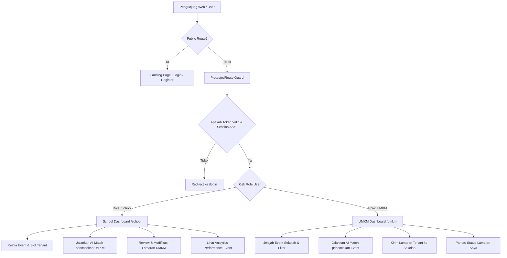

# 🌐 VENU Frontend Application — Comprehensive Technical Analysis & Documentation

Dokumen ini berisi analisis teknis mendalam mengenai arsitektur, teknologi, alur sistem, segi keamanan, dan benchmark performa dari aplikasi frontend **VENU** (Platform Kolaborasi Event Sekolah & UMKM).

---

## 📋 Daftar Isi
1. [Ringkasan Proyek](#-ringkasan-proyek)
2. [Tech Stack & Pustaka Utama](#-tech-stack--pustaka-utama)
3. [Arsitektur & Struktur Folder](#-arsitektur--struktur-folder)
4. [Alur Sistem & Workflow Frontend](#-alur-sistem--workflow-frontend)
5. [Analisis Keamanan (Security Analysis)](#-analisis-keamanan-security-analysis)
6. [Benchmark Performa & Evaluasi](#-benchmark-performa--evaluasi)
7. [Rekomendasi Pengembangan & Optimasi Lanjutan](#-rekomendasi-pengembangan--optimasi-lanjutan)
8. [Panduan Penggunaan & Panduan Dev](#-panduan-penggunaan--panduan-dev)

---

## 🎯 Ringkasan Proyek

Frontend VENU dirancang sebagai Single Page Application (SPA) modern yang menghubungkan **Pihak Sekolah** (penyelenggara event/bazar) dengan **UMKM** (tenant/vendor) menggunakan pencocokan cerdas **AI Match Engine**. Aplikasi ini memiliki antarmuka yang dinamis, responsif, berkinerja tinggi, dan dipisahkan secara tegas berdasarkan Role-Based Access Control (RBAC).

---

## 🛠️ Tech Stack & Pustaka Utama

| Kategori | Teknologi / Pustaka | Versi | Peran & Deskripsi |
| :--- | :--- | :--- | :--- |
| **Core Library** | React | `^19.2.8` | UI Library utama berbasis komponen dengan React 19 Automatic Batching. |
| **Build Tool & Bundler** | Vite | `^8.2.2` | Dev server super cepat berbasis ES Modules & HMR (Hot Module Replacement). |
| **Styling Engine** | Tailwind CSS | `^4.3.3` | Utility-first CSS framework (v4) menggunakan `@tailwindcss/vite` plugin tanpa PostCSS legacy. |
| **Routing** | React Router DOM | `^7.18.2` | Client-side routing dengan dukungan `ProtectedRoute`, `Navigate`, & `Outlet`. |
| **HTTP Client** | Axios | `^1.19.0` | Client HTTP terkonfigurasi dengan Interceptor otomatis untuk Sanctum Bearer Token. |
| **Icons & Assets** | Lucide React & React Icons | `^1.34.0` / `^5.7.0` | Collection icon modern dan komprehensif. |
| **Linter & Formatting** | ESLint | `^10.9.0` | Menjaga konsistensi kode React, Hook rules, dan standar Javascript modern. |

---

## 📁 Arsitektur & Struktur Folder

Aplikasi menggunakan arsitektur **Domain-Driven Modular / Feature-First Architecture** yang memisahkan logika bisnis per domain fitur untuk maintainability skala besar.

```
frontend/
├── public/                 # Static public assets (favicon, manifest, dll)
├── src/
│   ├── assets/             # Branding assets (logo, gambar statis)
│   ├── components/         # Component UI Reusable
│   │   ├── ai-match/       # Komponen visualisasi AI Match Engine & scoring
│   │   ├── common/         # Button, Input, Modal, Card, Loading UI universal
│   │   ├── event-management/# Form event, statistik tenant, analytics chart
│   │   ├── landing/        # Hero section, feature Showcase, AI Intro
│   │   ├── layout/         # Navbar, Footer, AuthLayout, Sidebar
│   │   ├── school/         # Card event sekolah, tenant application cards
│   │   └── umkm/           # Catalog produk UMKM, event discovery cards
│   ├── context/            # Global State Management
│   │   ├── AuthContext.jsx # Provider autentikasi (user, token, session check)
│   │   └── useAuth.js      # Custom Hook isolasi untuk React Fast Refresh
│   ├── features/           # Domain Logic (API calls & Custom Hooks)
│   │   ├── ai-match/       # matchApi.js, useSchoolMatches.js, useUmkmMatches.js
│   │   ├── event-discovery/# eventApi.js, useEvents.js, useNearbyEvents.js
│   │   ├── event-management/# eventManagementApi.js, useEventApplications.js, dll
│   │   ├── profile/        # schoolProfileApi.js, umkmProfileApi.js
│   │   └── umkm/           # umkmApi.js, umkmCollaborationApi.js, useAvailableUmkms.js
│   ├── pages/              # Views / Page Components
│   │   ├── school/         # SchoolHome, EventSaya, SchoolApplications, TenantManagement, Analytics
│   │   ├── umkm/           # UmkmHome, JelajahEvent, LamaranSaya, UmkmProfile
│   │   ├── AiMatchSchool.jsx
│   │   ├── AiMatchUmkm.jsx
│   │   ├── LandingPage.jsx
│   │   ├── Login.jsx
│   │   └── Register.jsx
│   ├── routes/             # Client Routing System
│   │   ├── AppRouter.jsx   # Master Route Definitions
│   │   └── ProtectedRoute.jsx # Authorization Guard (Role-based filtering)
│   ├── services/           # Service Integrasi Centralized
│   │   └── api.js          # Axios instance dengan request interceptor Bearer Token
│   ├── utils/              # Utility & Helper Functions (mis. umkmImage.js)
│   ├── App.jsx             # Root Component
│   ├── index.css           # Global CSS & Tailwind v4 Theme Tokens (`--color-navy`, `--color-accent`)
│   └── main.jsx            # Entry point React DOM
├── .env                    # Configuration Environment (`VITE_API_BASE_URL`)
├── package.json
└── vite.config.js          # Vite + Tailwind v4 Configuration
```

---

## 🔄 Alur Sistem & Workflow Frontend



### Detail Lifecycle & State Management:
1. **Inisialisasi Session**: Saat aplikasi dibuka, `AuthContext` memeriksa keberadaan `venu_token` di `localStorage`. Jika ada, `AuthContext` melakukan request verifikasi session ke endpoint `/auth/me`.
2. **Dynamic Axios Interceptor**: Setiap request HTTP dari `src/services/api.js` secara otomatis menyisipkan header `Authorization: Bearer <token>` tanpa perlu ditulis ulang pada komponen.
3. **Role-Based Routing (RBAC)**: `ProtectedRoute` mengevaluasi role pengguna (`school` vs `umkm`). Jika pengguna bertipe `school` mencoba mengakes route `/umkm/*`, aplikasi secara otomatis melakukan redirect aman ke `/school`.

---

## 🔒 Analisis Keamanan (Security Analysis)

### 1. Kelebihan Keamanan yang Sudah Diimplementasikan (Existing Strengths)
* **Client-Side Role Authorization Guard**: Mencegah *Unauthorized Route Access* antar role pengguna melalui `ProtectedRoute.jsx`.
* **Automatic Invalid Session Cleanup**: Jika token kadaluarsa atau di-revoke oleh backend (dideteksi via kegagalan `/auth/me`), `AuthContext` menghapus token dari `localStorage` dan mereset state `user` ke `null`.
* **Environment Variable Abstraction**: URL Backend terisolasi dalam `import.meta.env.VITE_API_BASE_URL`, menghindari hardcoding endpoint pada bundle distribusi.
* **Input Control & Sanitization**: Form Login & Register menggunakan controlled React state untuk mencegah potensi Script Injection liar.

### 2. Isu & Potensi Celah Keamanan (Security Vulnerabilities / Risks)
* ⚠️ **Local Storage Token Storage (XSS Vulnerability)**: 
  * *Temuan*: Token ditaruh di `localStorage.getItem("venu_token")`. Jika terjadi celah Cross-Site Scripting (XSS) melalui pustaka pihak ketiga, skrip jahat dapat membaca token tersebut.
  * *Rekomendasi*: Pindahkan arsitektur autentikasi Sanctum ke **HttpOnly, Secure, SameSite Cookie** agar token tidak dapat diakses via Javascript `document.cookie` / `localStorage`.
* ⚠️ **Missing Response Interceptor 401/403**:
  * *Temuan*: Jika token mati saat pengguna melakukan aksi di tengah sesi (misalnya submit lamaran), Axios belum memiliki response interceptor universal untuk mereset sesi dan mengarahkan pengguna secara mulus ke halaman login.
  * *Rekomendasi*: Tambahkan `api.interceptors.response.use` untuk menangkap status `401 Unauthorized`.

---

## ⚡ Benchmark Performa & Evaluasi

### 1. Metric Build Bundle (Hasil Benchmark Production Build)
Hasil kompilasi aktual menggunakan Vite & Rollown Bundler:

```
dist/index.html                   0.67 kB │ gzip:   0.42 kB
dist/assets/index-CPQWfUD4.css   84.70 kB │ gzip:  14.98 kB
dist/assets/index-L3ZkPqq6.js   564.10 kB │ gzip: 148.49 kB
✓ Built in 11.48s (1943 modules transformed)
```

### 2. Analisis Performa
* 🟢 **CSS Delivery**: CSS terkompresi hingga **14.98 kB (gzipped)** berkat engine Tailwind v4 yang melakukan tree-shaking secara agresif hanya untuk class yang digunakan.
* 🟡 **Bundle Chunk Size**: JS bundle utama sebesar **564.10 kB (148.49 kB gzipped)** memunculkan warning Vite (`> 500 kB`). Hal ini disebabkan seluruh halaman dikemas dalam satu chunk utama tanpa Code Splitting / Lazy Loading.

---

## 🚀 Rekomendasi Pengembangan & Optimasi Lanjutan

1. **Implementasi Code Splitting & Route Lazy Loading**:
   Gunakan `React.lazy()` dan `<Suspense>` pada `AppRouter.jsx` untuk memecah bundle JS per halaman (`SchoolHome`, `UmkmHome`, `AiMatchSchool`, `AiMatchUmkm`). Ini akan memotong ukuran awal load JS hingga **> 60%**.
   
   ```jsx
   const SchoolHome = React.lazy(() => import('../pages/school/SchoolHome'));
   const UmkmHome = React.lazy(() => import('../pages/umkm/UmkmHome'));
   ```

2. **Integrasi Caching Query Layer (TanStack / React Query)**:
   Saat ini fitur fetch data menggunakan custom `useEffect` native. Mengintegrasikan React Query akan memberikan:
   * Automatic background revalidation.
   * Caching data event & AI Match antar navigasi halaman tanpa refetch berulang.
   * Optimistic updates untuk pengiriman lamaran tenant.

3. **Response Interceptor untuk Handling Token Expired**:
   Tambahkan response interceptor pada `services/api.js`:
   ```javascript
   api.interceptors.response.use(
     (response) => response,
     (error) => {
       if (error.response && error.response.status === 401) {
         localStorage.removeItem("venu_token");
         window.location.href = "/login";
       }
       return Promise.reject(error);
     }
   );
   ```

---

## 💻 Panduan Penggunaan & Panduan Dev

### Prasyarat
* Node.js v18.0.0 atau versi lebih baru
* npm v9.0.0 atau versi lebih baru
* Laravel Backend running pada `http://localhost:8000`

### Setup Environment
Buat file `.env` di dalam root folder `frontend/`:
```env
VITE_API_BASE_URL=http://localhost:8000/api/v1
```

### Perintah Pembangunan (Commands)
```bash
# 1. Install Dependensi
npm install

# 2. Jalankan Mode Development (Hot Reload)
npm run dev

# 3. Kembangkan Production Build Lokal & Linting
npm run build
npm run lint

# 4. Preview Production Build Lokal
npm run preview
```

---
*Dokumen ini diperbarui secara otomatis berdasarkan audit arsitektur dan kompilasi benchmark frontend VENU.*
